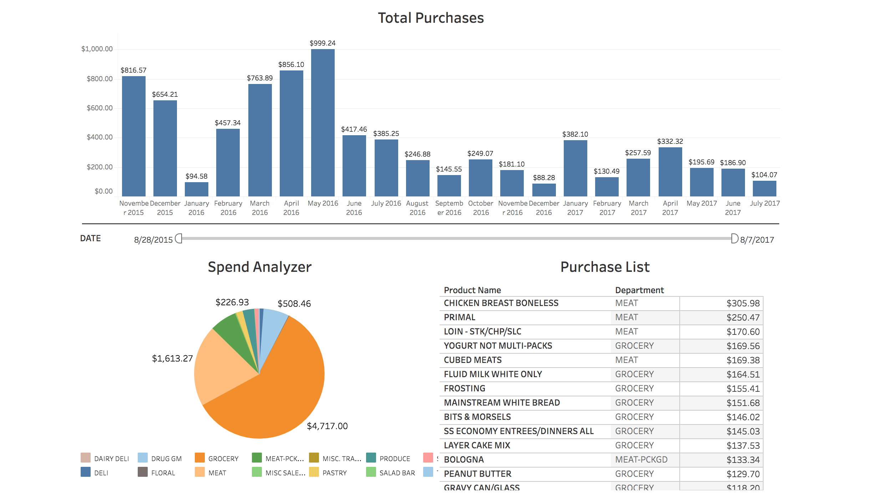

## 8451 Hack for Food Recommendations

Link to site [here](http://rawgit.com/Shubh17/8451/master/source/index.html)!  

The goal of this project is to take the open dataset of shopping information from Kroger stores and generate insights from the data. Namely, we would like to be able to give shoppers the ability to visualize their purchases and recommend food options.
  
We're using Tableau to visualize our dataset, and for recommending food products we're using a scikit learn's linear regression classification algorithm.  

## Datasets Received from
[Shopping Data](http://www.8451.com/area51/)  

This dataset is a series of normalized database tables. The database tables hold information on a Krogger credit card holder. These tables have demographic information, transaction data, and product information. The challenge is to take those tables stored as .csv and aggregate the pertinent information. Tables were tied together by usedID's or productID's.

## Results

## Future Work
